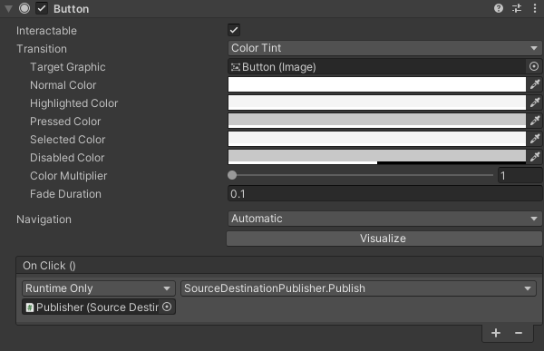
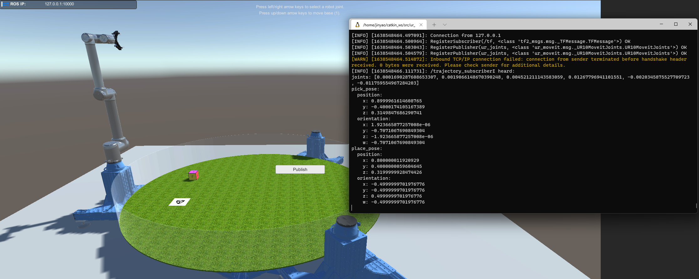

# Pick-and-Place Tutorial: Part 2

**Table of Contents**
  - [The Unity side](#the-unity-side)
  - [The ROS side](#the-ros-side)
  - [Run the game](#run-the-game)

---

## The Unity side

1. The game has been tested on publishing the robot state, target pose, and target placement pose to ROS. Select Publisher game object in the Hierarchy view, check `Source Destination Publisher`, and uncheck `Trajectory Planner` (currently in deve). Please refer to [SourceDestinationPublisher](https://github.com/Unity-Technologies/Unity-Robotics-Hub/blob/main/tutorials/pick_and_place/2_ros_tcp.md) if you want to know how `Source Destination Publisher` works. 

2. Select `Button` game object in Hierarchy view under `Canvas`. In the `Inspector` view, `On click ()`, switch to `SourceDestinationPublisher.Publish`. 




## The ROS side

Open a terminal window in the ROS `catkin` workspace. Then run the following command 
```
roslaunch ur_moveit part_2.launch
```

## Run the game
Return to Unity, and press play. Click the UI `Publish` Button in the Game view. ROS and Unity have now sucessfully connected! 


