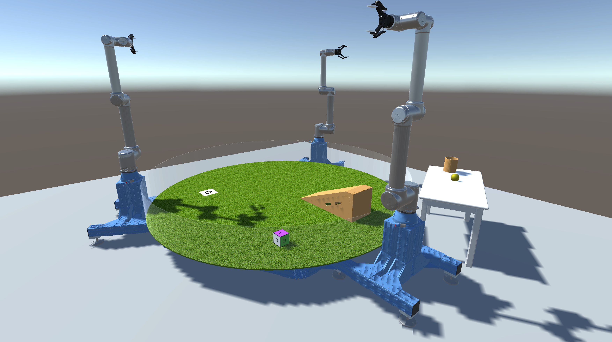

# FetchGamePhysics

This repo is built upon [FetchGame](https://github.com/JohnsonLabJanelia/FetchGame). Many inspirations are taken from [Unity-Robotics-Hub](https://github.com/Unity-Technologies/Unity-Robotics-Hub), especially the [Pick-and-Place Tutorial](https://github.com/Unity-Technologies/Unity-Robotics-Hub/blob/main/tutorials/pick_and_place/README.md) and [Object Pose Estimation Tutorial](https://github.com/Unity-Technologies/Robotics-Object-Pose-Estimation). A basic familiarity on these two tutorials and [ROS Tutorial](http://wiki.ros.org/ROS/Tutorials) would help better working with FetchGamePhysics.  

---
Table of contents
  - [Part 1: Installation Instruction](#part-1-installation-instruction)
  - [Part 2: ROS–Unity Integration](#part-2-rosunity-integration)
  - [Part 3: Pick-and-Place In Unity](#part-3-pick-and-place-in-unity)
---

## [Part 1: Installation Instruction](1_installation_instruction.md)

## [Part 2: ROS–Unity Integration](2_ros_unity_integration.md)

## [Part 3: Pick-and-Place In Unity](3_pick_and_place.md)

## TODO
- [x] Trajectory planner for picking up the cube and place it on the goal.
- [ ] Integrate three robots, working tables, ramp to complete the scene.
- [ ] Integration with ur_rtde and UR offline simulator. 
- [ ] Integration with real robot. 
